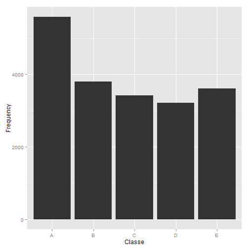

Practical Machine Learning - Project
========================================================
by Kamil Simka

# Project Description

Using devices such as Jawbone Up, Nike FuelBand, and Fitbit it is now possible to collect a large amount of data about personal activity relatively inexpensively. These type of devices are part of the quantified self movement - a group of enthusiasts who take measurements about themselves regularly to improve their health, to find patterns in their behavior, or because they are tech geeks. One thing that people regularly do is quantify how much of a particular activity they do, but they rarely quantify how well they do it. In this project, the goal is to use data from accelerometers on the belt, forearm, arm, and dumbell of 6 participants. They were asked to perform barbell lifts correctly and incorrectly in 5 different ways. More information is available from the website here: http://groupware.les.inf.puc-rio.br/har (see the section on the Weight Lifting Exercise Dataset). The goal of this project is to predict the manner in which they did the exercise. 

# Data 

The data for this project come from this source: [http://groupware.les.inf.puc-rio.br/har].

The training data for this project are available here: [https://d396qusza40orc.cloudfront.net/predmachlearn/pml-training.csv]
The test data are available here: [https://d396qusza40orc.cloudfront.net/predmachlearn/pml-testing.csv]

We first load taining and testing data sets in R and load necessary packages for the analysis.

```r
training<-read.csv("pml-training.csv", na.strings = c("NA", ""))
testing<-read.csv("pml-testing.csv", na.strings = c("NA", ""))
library(caret); library(rpart); library(rattle); library(randomForest)
```

```
## Loading required package: lattice
## Loading required package: ggplot2
## Rattle: A free graphical interface for data mining with R.
## Version 3.3.0 Copyright (c) 2006-2014 Togaware Pty Ltd.
## Type 'rattle()' to shake, rattle, and roll your data.
## randomForest 4.6-10
## Type rfNews() to see new features/changes/bug fixes.
```

#### Data processing

Naxt, we exclude variables with all 'NA' obsevations and first 7 columns irrelevant for the analysis.


```r
training <- training[,colSums(is.na(training)) == 0]
training <- training[,-c(1:7)]
```

Finally, we check the frequency in which each class (A,B,C,D,E) occurs in training data set.

Classes description:
exactly according to the specification (Class A), throwing the elbows to the front (Class B), lifting the dumbbell only halfway (Class C), lowering the dumbbell only halfway (Class D) and throwing the hips to the front (Class E)

Read more: http://groupware.les.inf.puc-rio.br/har


```r
qplot(training$classe,xlab="Classe", ylab="Frequency")
```

 

# Prediction Models

In this part we will test 2 models: classification tree and random forest to predict observations in 'testing' data set.

First, we subset the training data set into to parts: 'trainingsumple' and 'testingsumple'.
We will then, train our model using 'trainingsumple' data set, and later we will test this model on 'testingsumple' data set.


```r
samples <- createDataPartition(y=training$classe, p=0.7, list=FALSE)
trainingsumple <- training[samples, ] 
testingsumple <- training[-samples, ]
```

### Classification tree

```r
set.seed(123)
ModFit <- rpart(classe ~ .,method = "class", data = trainingsumple)
```


```r
as.table(confusionMatrix(predict(ModFit, testingsumple,type="class"), testingsumple$classe))
```

```
##           Reference
## Prediction    A    B    C    D    E
##          A 1505  174   61  132   31
##          B   62  711   58   63   91
##          C   40   90  789  132  130
##          D   38   80   50  517   47
##          E   29   84   68  120  783
```

From the analysis of cross-tabulation of observed and predicted classes we conclude that this model is not very accurate.
Therefore we build second model based on random forest algorythm.

### Random Forest


```r
set.seed(123)
newModFit <- randomForest(classe ~.,method="class",data=trainingsumple)
```


```r
as.table(confusionMatrix(predict(newModFit, testingsumple,type="class"), testingsumple$classe))
```

```
##           Reference
## Prediction    A    B    C    D    E
##          A 1672   10    0    0    0
##          B    2 1129    3    0    0
##          C    0    0 1023   11    0
##          D    0    0    0  952    1
##          E    0    0    0    1 1081
```

```r
confusionMatrix(predict(newModFit, testingsumple,type="class"), testingsumple$classe)$overall
```

```
##       Accuracy          Kappa  AccuracyLower  AccuracyUpper   AccuracyNull 
##      0.9952421      0.9939808      0.9931309      0.9968362      0.2844520 
## AccuracyPValue  McnemarPValue 
##      0.0000000            NaN
```

The model based on Breiman's random forest algorithm is more accurate than simple classification tree. The cross validation accuracy is equal to 0.994 (99.4%) and The expected out-of-sample error is estimated at 0.004 (0.4%). 

# Submision


```r
predictfinal <- predict(newModFit, testing, type="class")
predictfinal
```

```
##  1  2  3  4  5  6  7  8  9 10 11 12 13 14 15 16 17 18 19 20 
##  B  A  B  A  A  E  D  B  A  A  B  C  B  A  E  E  A  B  B  B 
## Levels: A B C D E
```

```r
# Write files for submission
pml_write_files = function(x){
  n = length(x)
  for(i in 1:n){
    filename = paste0("problem_id_",i,".txt")
    write.table(x[i],file=filename,quote=FALSE,row.names=FALSE,col.names=FALSE)
  }
}

pml_write_files(predictfinal)
```
